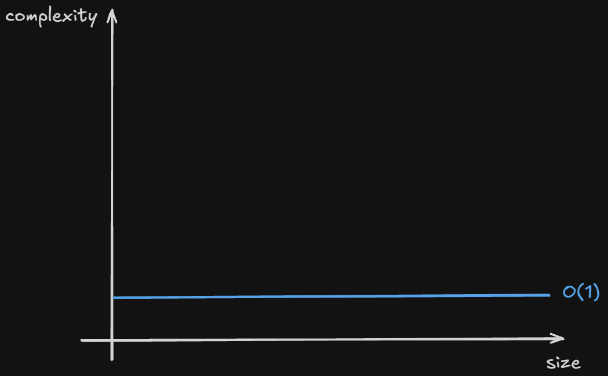
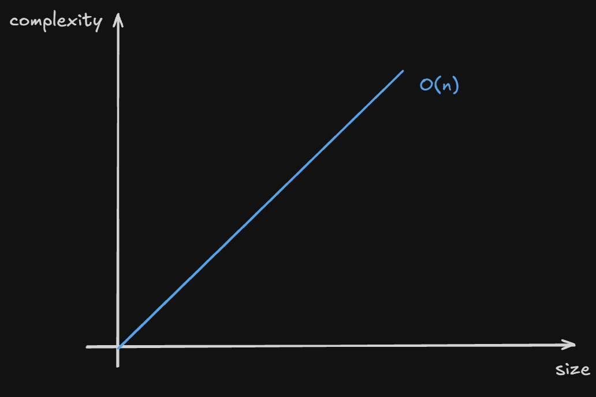

# data strucutres
## about this repository
- personal study notes on data strucutures in C (hard way). for all these data strucutres, i've implemented simple algorithms to demonstrate the key points of each one
## implemented
  - [ ] stack
  - [ ] queue
  - [ ] linked list
  - [ ] binary trees
## big O graphics
### stack
- push
  
- pop
  
- print
  
- peek
  
### queue
- enqueue
- dequeue
- print
### linked lists
- insert
- remove
- print
### binary search tree
- insert
- remove
- print
